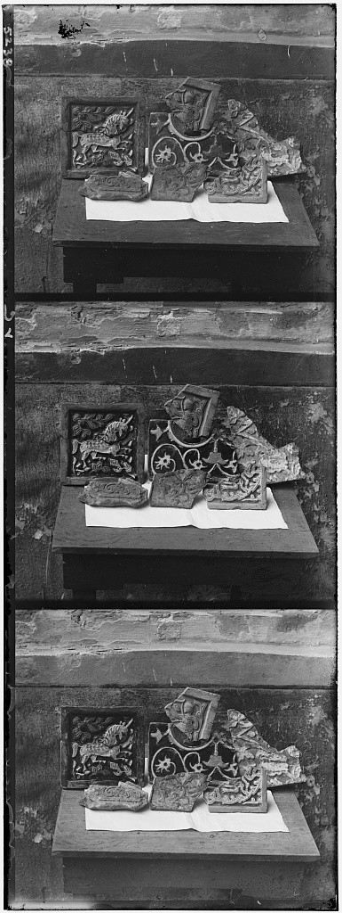
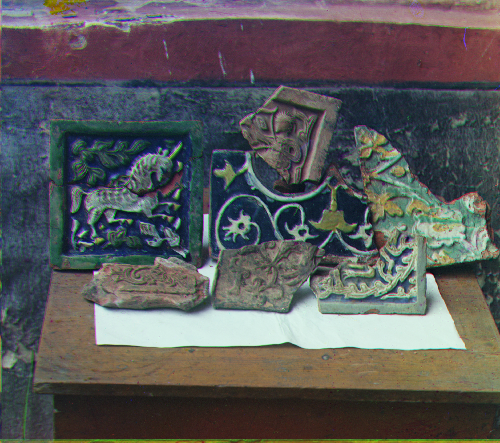

# Prokudin-Gorskii

Colorization of the Prokudin-Gorskii collection with whitebalancing.
 

The program has support for both Sum of squared differences (SSD) and Normalized cross correlation (NCC)

It also uses "image pyramids" to speed up the calculation process on bigger images.

To toggle between NCC and SSD, simply change the choice in alignMulti.m and alignSingle.m

A more detailed report can be found in SampleWebpage

All test results can be found in the output folder

<table border="1">
<tbody>
  <tr>
    <td>Original image</td>
  </tr>
  <tr>
    <td></td>
  </tr>
  <tr>
    <td>Result image</td>
  </tr>
  <tr>
    <td></td>
  </tr>
</tbody></table>
